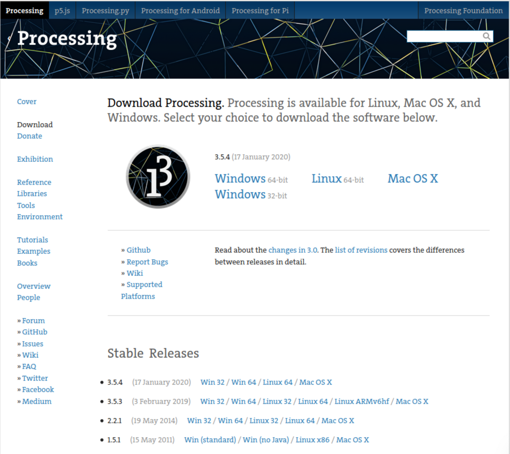

# visualizations

This project includes multiple visualization peojects

## Getting Started

### Processing
For some of these projects you use the processing software sketchbook.

To download, please go to this website

*[Processing](https://processing.org/) - sketchbook used

### Clone

Next step is cloning the repo

### Run file

Simply click on the play button.

