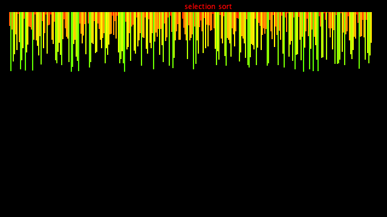
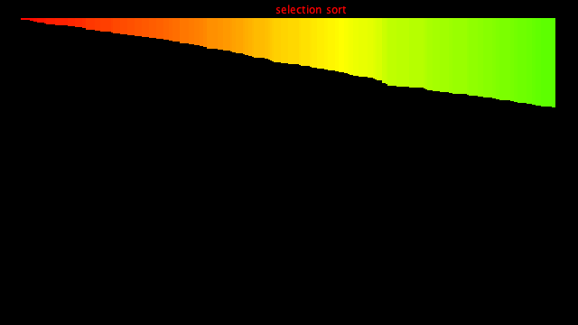

# selection_sorting
### In This project I made a visual representation of selection sorting ###

For this first example, I am using processing. To learn more about this Java based language and software, go to: https://processing.org/

Output will go from:

to: 

the actual vid should look like:

